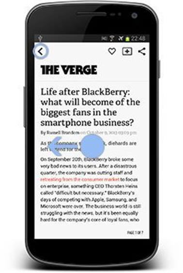
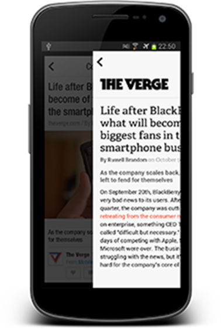

# Házi feladat specifikáció

Információk [itt](https://viauav21.github.io/laborok/hf)

## Androidalapú szoftverfejlesztés
### [Dátum - 2023 1. félév]
### [Teljes név] - ([Neptun kód])
### [e-mail cím] 
### Laborvezető: [Laborvezető neve]

## Bemutatás

Az alkalmazás rövid, 2-3 mondatos bemutatása. Honnan az ötlet, mi szülte az igényt, ki lehetne a célközönség.
A laboron és előadáson bemutatott alkalmazásokat nem lehet házi feladatnak választani.

## Főbb funkciók

Az alkalmazás minden funkciójára kiterjedő leírás. Legyen egyértelműen eldönthető, hogy az adott funkció implementálva van-e!
P.l.: Az alkalmazással lehetőség van térképen megjeleníteni az állomáspontokat és azok A,B,C,D tulajdonságai meg is jelennek (ha elérhetőek).

## Választott technológiák:

Az alkalmazás fejlesztése során használt technológiák tételes felsorolása. Az, hogy mi számít technológiának a laborokon ismertetésre kerül, a laborvezetőkkel tovább pontosítható. 
5 technológia használata javasolt. Például:

- UI: A felhasználói felület Jetpack Compose-ban és MVVM architektúrával.
- lista: A kriptovatuták egy-két fontosabb részlettel együtt egy komplex listában jelennek meg. 
- Hálózatkezelés: Az alkalmazás a [https://coinbin.org/](https://coinbin.org/) nyílt API-t használja, és REST végponton keresztül tölti le az kritovaluták adatait.
- Adatbáziskezelés: A felhasználó elmentheti a számára fontos kriptovaluták listáját, amit az alkalmazás perzisztensen tárol
- Notificationök: Az alkalmazás értesítést küld, ha egy kpritovaluta ára az elmentett értékhez képest 10%-nál többet változott.

___

# Házi feladat dokumentáció

### [Alkalmazás neve]

**Legkésőbb a dokumentáció fázisban lecserélendő a saját ikonnal!**

## Bemutatás

Az alkalmazás rövid, 2-3 mondatos bemutatása. Honnan az ötlet, mi szülte az igényt, ki lehetne a célközönség.
A laboron és előadáson bemutatott alkalmazásokat nem lehet házi feladatnak választani.

## Főbb funkciók

Az alkalmazás minden funkciójára kiterjedő leírás. Legyen egyértelműen eldönthető, hogy az adott funkció implementálva van-e!
P.l.: Az alkalmazással lehetőség van térképen megjeleníteni az állomáspontokat és azok A,B,C,D tulajdonságai meg is jelennek (ha elérhetőek).

## Felhasználói kézikönyv

Az alkalmazás minden funkciójára kiterjedő, teljes körű felhasználói leírás. Az összes releváns képernyőhöz/funkcióhoz tartalmaznia kell képernyőképet!

A képernyőképekkel kapcsolatos követelmények:

- Android Device Art Generator-ral telefont/tabletet kell rajzolni a képernyő köré!
	- Mindegy, hogy melyik készüléket választod, de legyen egységes az egész dokumentumban!
	- Telefonra tervezett képernyőket valamelyik telefon skin-nel, tablet képernyőt (amennyiben készítettél külön) tablet skin-nel készítsünk!
- Álló képernyőket álló módban, fekvőket fekvő módban rakjuk be! (Értelemszerűen. Ha fekvő képernyőképet húzol be a generator-ba, akkor fekvő módban rajzolja köré az eszközt)
-	Minden képhez legyen képaláírás, ami leírja hogy mit kell nézni a képen!
-	A képeket úgy méretezzük, hogy álló telefon méretből kettő elférjen egymás mellett egy sorban (fekvő illetve tablet képeket ehhez viszonyítva nagyítsuk)!
-	Amennyiben gesztúra vezérlést akarunk bemutatni a képernyőn, jelezzük a gesztúrát is! (ld példa kép)
-	A képeket és a képaláírásokat középre igazítsuk!

1. ábra: Gesztúrával és gombbal is navigálható képernyők, hasznos kényelmi funkció a felhasználónak ha több lehetőséget is biztosítunk a navigációra

## Felhasznált technológiák:

Itt kell felsorolni minden technológiát, technikát, külső könyvtárat, komplexebb algoritmust, ami növeli az alkalmazás értékét. Osztályzáskor ezt a fejezetet nézzük meg először.

Külső osztálykönyvtár használata esetén a könyvtár neve legyen link, ami annak elérhetőségére mutat.

A kulcsszavak legyenek **félkövér** betűtípussal szedve.
Például:

- •	Az X és Y képernyők optimalizáltak **álló és fekvő nézetre** is
- [YCharts](https://github.com/yml-org/YCharts) osztálykönyvtár használata a grafikonok rajzolására
- **Fused Location API** használata helymeghatározásra
- **SQLite** alapú adattárolás
- Implicit intent használata **QR kód beolvasáshoz** (telepített Barcode Scanner alkalmazás szükséges a futtatásához)
- A játék fizikáját a [Box2D](https://box2d.org/) motor biztosítja
- **Service** használata zenelejátszáshoz

## Fontosabb technológiai megoldások

**A számodra legnehezebb/legérdekesebb funkciót fejtsd ki kb.  10 mondatban, hogy mi volt a probléma és hogyan oldottad meg.**