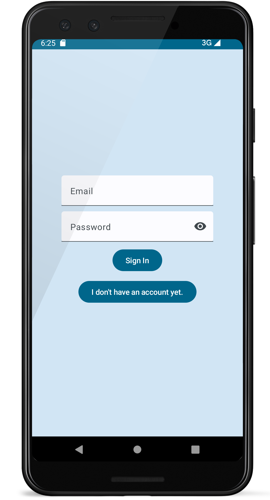
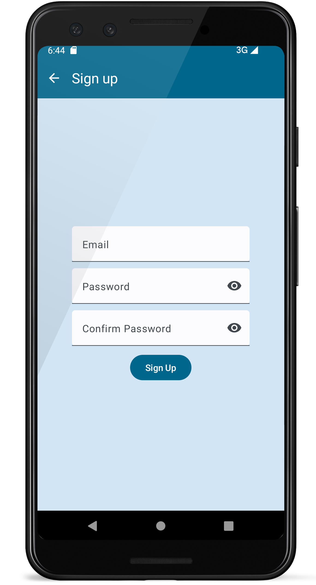
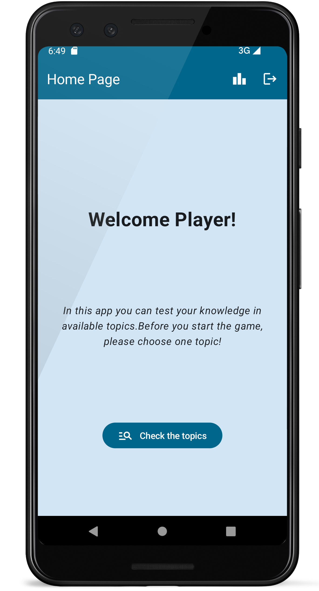
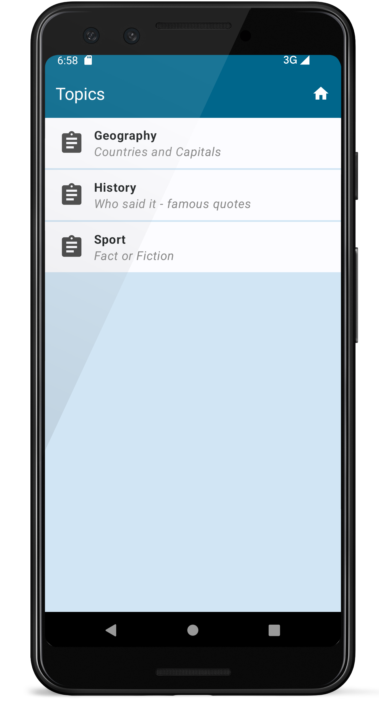
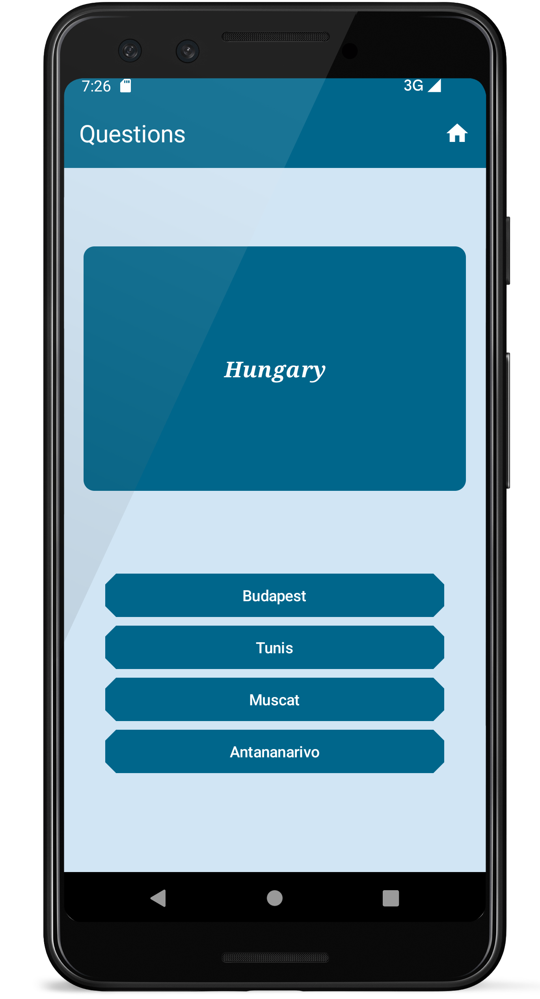
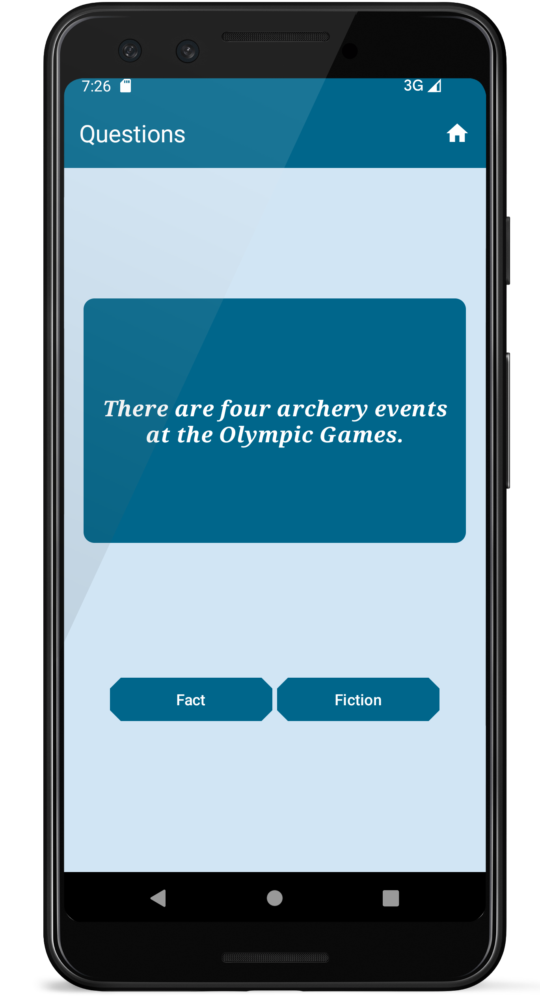
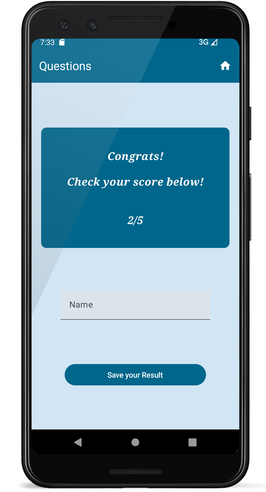
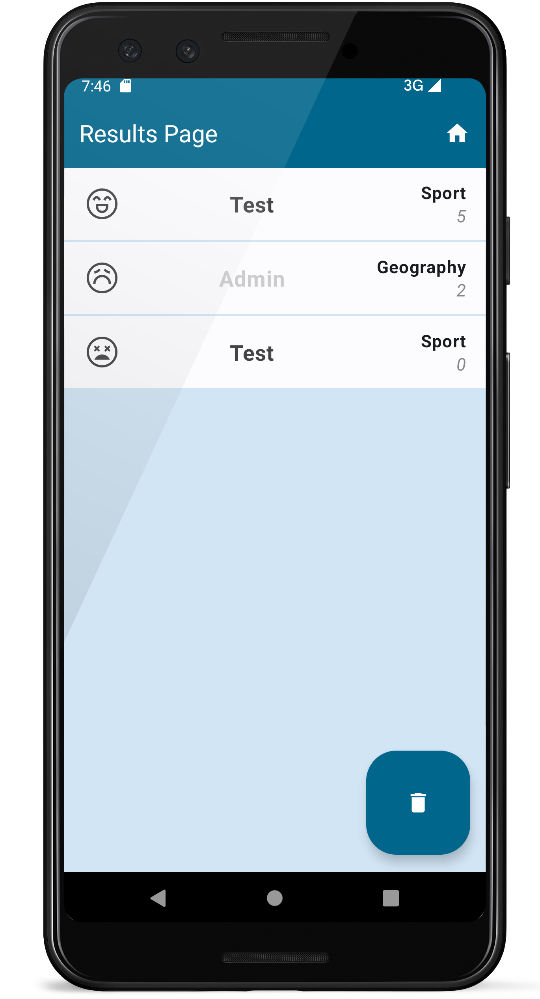

# Házi feladat dokumentáció

## Androidalapú szoftverfejlesztés

### 2023.05.28. - 2023 1. félév

### Göndöcs Martin

### martin.gondocs@gmail.com

### QuizRank

## Bemutatás

Az alkalmazás egy kvízt szimulál. Több, különböző témájú kvíz kitöltése lehetséges. Kitöltés végén az eredményeket tároljuk, egy rangsor készül, melyben összevethetőek pontjaink más játékosok pontjaival egy adott témán belül.
(Ötlet: Quizlet, Kahoot.)

## Főbb funkciók

Az alkalmazás lehetőséget nyújt saját felhasználói fiók létrehozására. A felhasználónak az eredményeit a saját fiókjához kötjük. A fiók minden más esetben arra használható, hogy az illető bejelentkezzen az alkalmazásba.

Bejelentkezést követően többféle témából lehet választani. Minden téma tartalmazz adott mennyiségű kérdést. A kérdések feleletválasztósak. A kérdések négy, illetve kettő lehetséges választ tartalmazhatnak, melyek közül kizárólag csak egy helyes. A helyesen megválaszolt kérdésre lehet kapni egy pontot. 

Bejelentkezés után csak akkor kell újra bejelentkezni a felhasználónak, ha a kezdőképernyőn kijelentkezett.

A kérdések kitöltése közben vissza lehet térni a kezdőképernyőre, viszont ekkor töröljük a korábban megválaszolt kérdéseket. Ezt követően lehet újra témát választani.

Minden kitöltött kérdés után egy összesítő oldal található. Itt megtekinthető adott témában elért pontszám. A pontszám elmenthető, mely ezt követően a ranglistán megtekinthető. Az elmentés előtt megadható egy tetszőleges név, melyet a saját eredményhez rendelhető. Ezt követően az alkalmazásban vissza lehet térni a kezdőképernyőre.

A kezdőképernyőn lehetőség van a ranglista megtekintésére. A ranglistán látható más játékosok pontszáma mellett a felhasználó pontszáma is. Előbbi halvány szürkén, míg utóbbi sötét szürkén. A ranglistán az eredmények először pontok alapján csökkenő sorrendben, majd témák szerint abc sorrendben tekinthetőek meg. Minden eredményhez tartozik egy ikon, mely az eredménnyel kapcsolatos elégedettségi szintet mutathatja. A pontok felett megtekinthető, hogy az melyik témában lett elérve.
A ranglistán törölhető az összes saját eredmény.

### [QuizRank]

## Felhasználói kézikönyv

A bejelentkeztető oldalon adjuk meg felhasználói email-címünket és ahhoz tartozó jelszónkat. A jelszó alapértelmezetten kicsillagozva jelenik meg. A jelszó szöveges megjelenítéséhez a szövegdoboz jobb végén található szemre nyomjunk.
Ezt követően nyomjunk a(z) "Sign In" gombra.
Amennyiben nincs felhasználói fiókunk, akkor nyomjunk a(z) "I don't have an account yet." gombra.

1. ábra: Szövegdobozokban megadhatóak a felhasználói fiók adatai, illetve gombokkal tovább navigálhatunk a regisztráló oldalra - ha nincs felhasználói fiók - vagy a kezdőképernyőre sikeres bejelentkeztetést követően.

A(z) "I don't have any account yet." gomb hatására létrehozhatjuk saját felhasználói fiókunkat. Ehhez adjunk meg egy email-címet, illetve jelszót, ahol az utóbbit még egyszer meg kell adni. Így ellenőrizhető, hogy nem történt elgépelés a jelszó megadása során. A(z) "Sign up" gomb hatására a jól megadott adatok mentésre kerülnek, mellyel létrejött a felhasználói fiók.
Ezt követően az alkalmazás kezdőképernyőjére kerülünk.

2. ábra: Szövegdobozokban megadhatóak a felhasználói fiók létrehozásához szükséges adatok, illetve gombbal menthetjük el adatainkat.
3. ábra: A kezdőképernyő. Alul egy gombbal a témákhoz navigálhat, illetve jobb felső sarokban két gomb segítségével megtekinthető a ranglista vagy kijelentkezhet az alkalmazásból.

A kezdőképernyőn három lehetőségünk van:
 - A(z) "Check the topics" gomb hatására megtekinthetjük a lehetséges témákat.
 - A jobb felső sarokban található 'Leaderboard' ikonra nyomva megtekinthető a ranglista.
 - Szintén a jobb felső sarokban a(z) 'Sign off' gombra nyomra kijelentkezhetünk az alkalmazásból.
 Kijelentkezés esetén visszatérünk a 1. ábrán látott képernyőhöz, vagyis a bejelentkeztető oldalhoz.

A témák egymás alatt megtekinhetőek egy listában. Minden téma rendelkezik egy névvel - vastagon szedett - illetve egy leírással - halvány, dőlt - mely utalást ad a tesztsor felépítésére, jellegére. Egy témát kiválasztva kitölthető az ahhoz tartozó kérdéssor. Egy kérdéssor tetszőleges mennyiségű kérdést tartalmazhat. Egy kérdéshez tartozik négy, illetve más témák esetén kettő lehetséges válasz, melyek közül pontosan egy helyes, a többi helytelen. A helyes válasz esetén egy pont szerezhető a kérdéssoron.
A kérdéssor kitöltés közben abbahagyható, ehhez a jobb felső sarokban található 'Home' ikonra kell nyomni. Ekkor a kérdésre adott válaszokat a program törli.
A kérdéssor kitöltése után egy összesítő oldal jelenik meg.

4. ábra: Témákat megjelenítő oldal. A témák egymás alatt láthatóak egy listában. A kezdőképernyőre visszatérhet a jobb felső sarokban található 'Home' ikonnal. Adott témára kattintva kitölthető ahhoz tartozó tesztsor.

A kérdéseket megjelenítő képernyőn fentről lefelé haladva megtalálható maga a kérdés egy nagyobb téglalapban, majd a lehetséges válaszok kisebb téglalapokban. A képernyő elrendezése változik attól függően, hogy hány lehetséges válasz áll rendelkezésre. A helyen gondolt válaszra nyomjunk rá, így az alkalmazás megjeleníti a következő kérdést adott témában, amennyiben rendelkezésre áll.

5. ábra: Négy lehetséges választ tartalmazó kérdés. A lehetséges válaszra nyomva előhozható a következő kérdés, amennyiben rendelkezésre áll (egyébként összesítő oldal). A kitöltés közben a jobb felső sarokban található 'Home' ikonnal térhet vissza a kezdőképernyőre.
6. ábra: Kettő lehetséges választ tartalmazó kérdés, hasonló funkcionalitással, mint a négyet tartalmazó.

Az összesítő oldalon a nagy téglalapon megtekinthető a tesztsoron elért eredményünk (saját pontszám/összes pontszám formában.) Az eredmény elmentésére szolgál az ez alatt található szövegdoboz, ahol a nevünket megadhatjuk. Ezt követően a "Save your Result" gombra kattintva elmenthetjük az eredményünket, melyet később a ranglistán viszontláthatunk.
Szintén itt is, eredmény elmentése nélkül visszatérhetünk a kezdőképernyőre.

7. ábra: Jobb felső sarokban található ikonnal visszatérhet a kezdőképernyőre. Szövegdoboz segítségével nevet is rendelhet elért eredményéhez. Gomb segítségével elmentheti ezen eredményét.

A ranglista egy lista, mely tartalmazza sorrendezve az összes felhasználó eredményét. A rangsor pontszám szerint csökkenő, majd téma neve szerint abc sorrendben van. A saját felhasználói fiókunkhoz tartozó eredményeket vastagon szedetten láthatjuk, míg más felhasználókét halványabban.
Egy eredményhez tartozik egy elégedettségi ikon. Összesen ötféle reakció váltható ki pontszám alapján. Az ikon mellett megtalálható a felhasználó által megadott név a teszt kitöltése végén, illetve adott téma és az elért pontszáma is.
A felhasználó saját eredményeit a jobb alsó sarokban található kuka segítségével törölheti.
Az eredmények megtekintése után a 'Home' ikonnal (felül) visszatérhetünk a kezdőképernyőre.

8. ábra: Eredményeket megjelenítő lista. Kuka gombbal törölhetőek saját eredményeink, illetve egy komplex listában megtekinthető más játékosok által eredmény is.

## Felhasznált technológiák:

- **Firebase Authentication** a felhasználói fiókok tárolására, létrehozására
- **Firebase Firestore**
	- témák, kérdések, eredmények tárolására
	- eredmények létrehozására
- **Jetpack Compose + MVVM** használata a megjelenítéshez, 
- Composable **komplex lista** (LazyColumn) használata
	- témák és eredmények felsorolására
- **Navigation** (Graph, Host, Controller) használata a képernyők közötti összeköttetésre
- **Hálózat**tal kommunikáló alkalmazás
- Teljes alkalmazásra kiterjedő **stílus** (QuizRankTheme)
- **Flow**, State használata recompositon miatt
- **Vector Asset**-ek létrehozása SVG-ből

## Fontosabb technológiai megoldások

Az alkalmazás készítése során több, kisebb probléma ütköztem, melyeket megpróbálok időrendi sorrendben leírni.
Először az **adatstruktúra** létrehozása Firebase oldalon nehezítette meg a fejlesztést. Minden témához (egy collection) tartozik egy téma (egy document). Minden témához tartozik több kérdés (egy collection). Minden kérdéshez (egy document) tartozik több lehetséges válasz - melyeket kollekció elkerülése végett - Map-ként kezelek kulcs (a, b, c, d) és érték (maga a lehetséges válasz szövegként) párok segítségével. Ezek egymásba vannak fűzve, így elérésük bonyolultabb.

A kérdéssort megjelenítő képernyőt minden lehetséges választ tartalmazó gomb nyomására újrarajzolok (**recomposition**), melyet state (flow) frissítésével érek el. Mivel a kérdések változó mennyiségű lehetséges választ tartalmazhatnak, így sok saját készítésű @Composable függvényen keresztül futnak végig a függvényhívások, kérdések adatait és a megnyomott gomb információja (visszafelé küldi). Ugyanakkor bármikor hozzáadható akár (jelenleginél kívül) más mennyiségű lehetséges választ tartalmazó képernyő is.

Végül a **képernyők** (Téma oldal - TopicsScreen és az Összesítő oldal - QuestionsScreen) **között** **adattovábbítás** történik több paraméterrel (pontosan három adattal). Átadásra kerül a választott téma azonosítója('id'), címe ('title'), és a felhasználó azonosítója ('userId'), aki jelenleg az alkalmazást használja. A téma azonosító az adott témához tartozó kérdések megtalálására, míg a cím és felhasználói azonosító az eredmények felkonfigurálására szolgál.